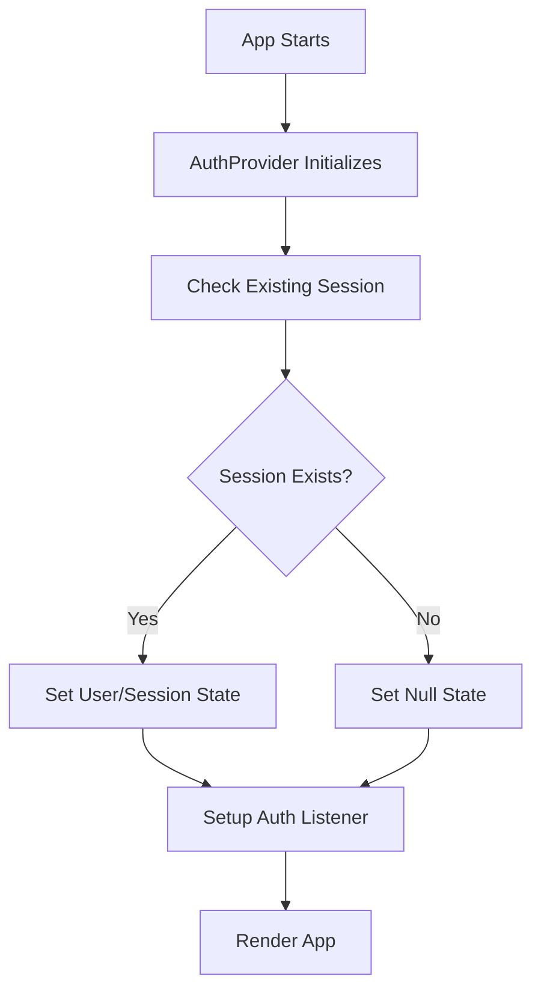
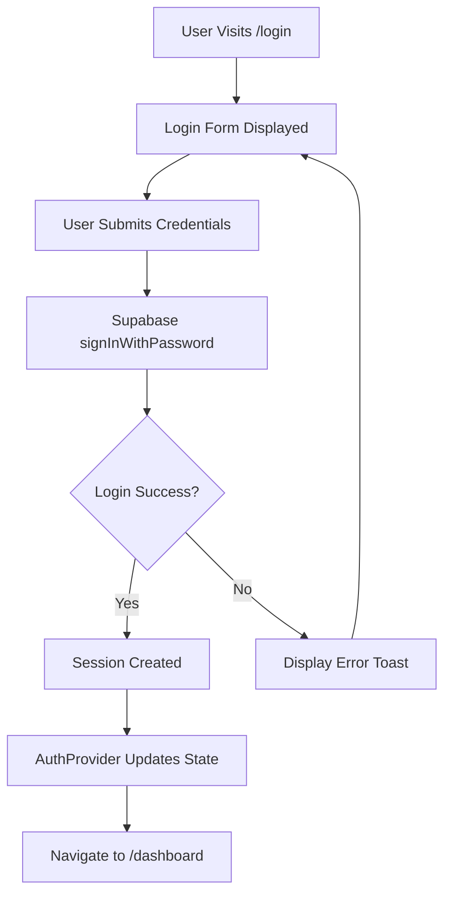
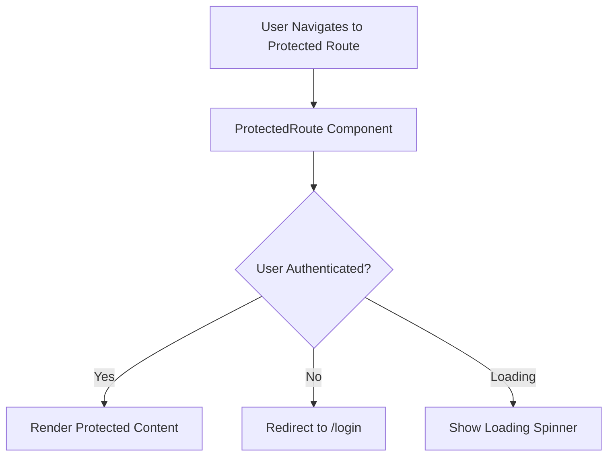
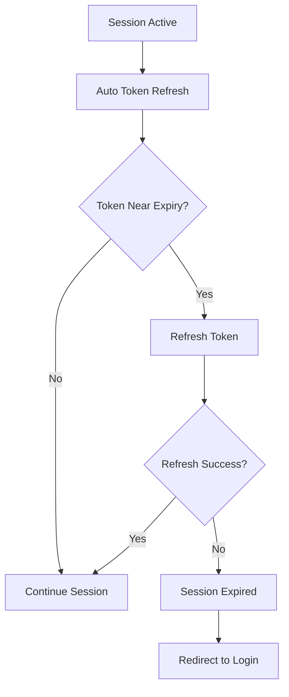

# CRM Software Authentication & Login Flow Documentation

## Overview

The CRM software uses **Supabase Authentication** with a React-based frontend for comprehensive user management, session handling, and protected route access. The system implements a full authentication flow with persistent sessions, automatic token refresh, and role-based access control.

## Architecture Components

### 1. **Supabase Client Configuration** (`src/integrations/supabase/client.ts`)
```typescript
export const supabase = createClient<Database>(SUPABASE_URL, SUPABASE_PUBLISHABLE_KEY, {
  auth: {
    storage: localStorage,           // Persist sessions in localStorage
    persistSession: true,           // Enable session persistence
    autoRefreshToken: true,         // Auto-refresh tokens before expiry
  }
});
```

**Key Features:**
- **Project ID**: `zupuxlrtixhfnbuhxhum`
- **URL**: `https://zupuxlrtixhfnbuhxhum.supabase.co`
- **Persistent Sessions**: Uses localStorage for session storage
- **Auto Token Refresh**: Automatically refreshes tokens before expiry
- **Type Safety**: Full TypeScript integration with generated types

### 2. **Authentication Provider** (`src/components/AuthProvider.tsx`)

**Purpose**: Centralized auth state management across the entire application.

**Key Features:**
- Maintains both `session` and `user` state objects
- Implements proper auth state initialization order
- Handles auth state changes in real-time
- Provides loading states during authentication

**Implementation Details:**
```typescript
interface AuthContextType {
  session: Session | null;    // Complete session with tokens
  user: User | null;         // User object
  loading: boolean;          // Loading state
}
```

**Authentication Flow:**
1. **Initialization**: Gets initial session from Supabase
2. **State Listener**: Sets up `onAuthStateChange` listener
3. **State Updates**: Updates session/user on auth changes
4. **Context Provider**: Provides auth state to entire app

### 3. **Protected Route Component** (`src/components/ProtectedRoute.tsx`)

**Purpose**: Route-level authentication guard for dashboard access.

**Behavior:**
- Shows loading spinner during auth check
- Redirects to `/login` if user not authenticated
- Renders protected content if user is authenticated

**Usage Pattern:**
```typescript
<Route path="/dashboard/crm" element={
  <ProtectedRoute>
    <CRMPage />
  </ProtectedRoute>
} />
```

### 4. **Login Page** (`src/pages/LoginPage.tsx`)

**Features:**
- Modern glassmorphism design with gradient backgrounds
- Pre-filled credentials for demo (`info@getb3acon.com` / `7354$$`)
- Animated typewriter effect showcasing platform features
- Comprehensive error handling with toast notifications
- Responsive design for all screen sizes

**Authentication Process:**
1. Form submission with email/password
2. Supabase `signInWithPassword()` call
3. Error handling and user feedback
4. Automatic redirect to `/dashboard` on success

## Complete Authentication Flow

### 1. **Initial App Load**


### 2. **Login Process**


### 3. **Protected Route Access**


### 4. **Session Management**


## Database Schema Integration

### User Profiles Table (`user_profiles`)
```sql
Table: user_profiles
- id: UUID (references auth.users)
- email: string
- full_name: string
- company: string
- plan: string (trial, starter, pro, enterprise)
- role: string (admin, user)
- admin_permissions: JSON
- api_usage_count: number
- api_usage_limit: number
- features_enabled: JSON
- created_at: timestamp
```

### Authentication Integration
- **RLS Policies**: All CRM tables use `org_id = auth.uid()` for row-level security
- **Plan Enforcement**: Database functions check user plans for feature limits
- **Admin Access**: Admin users bypass most restrictions
- **API Limits**: Usage tracking tied to user authentication

## Current Implementation Status

### ✅ **Implemented Features**
- [x] Supabase client configuration
- [x] Authentication provider with session management
- [x] Protected route components
- [x] Login page with error handling
- [x] Automatic token refresh
- [x] Session persistence
- [x] Role-based access (admin/user)
- [x] Plan-based feature restrictions
- [x] Database RLS policies

### ⚠️ **Areas Needing Improvement**

1. **Missing Signup Flow**
   - No dedicated signup/registration page
   - Login page has "Get started for free" link that goes to dashboard
   - Should implement proper user registration flow

2. **Password Reset**
   - No password reset functionality
   - Should add "Forgot Password" feature

3. **Email Verification**
   - Missing email confirmation flow
   - Should implement email verification for new accounts

4. **Profile Management**
   - No user profile editing interface
   - Should add settings page for profile updates

5. **Enhanced Security**
   - No MFA (Multi-Factor Authentication)
   - No social login options (Google, Microsoft)

## Files That Need Updates

### Priority 1: Critical Authentication Features

#### 1. **Create Signup Page** (`src/pages/SignupPage.tsx`)
```typescript
// New file needed
// Implement user registration with:
// - Email/password signup
// - Email verification flow
// - Plan selection
// - Company information collection
```

#### 2. **Update Login Page** (`src/pages/LoginPage.tsx`)
- Add "Forgot Password" link
- Fix signup redirect (currently goes to dashboard)
- Add proper error handling for different error types

#### 3. **Create Password Reset Flow**
```typescript
// New files needed:
// - src/pages/ForgotPasswordPage.tsx
// - src/pages/ResetPasswordPage.tsx
```

#### 4. **Update Route Configuration** (`src/App.tsx`)
```typescript
// Add new routes:
<Route path="/signup" element={<SignupPage />} />
<Route path="/forgot-password" element={<ForgotPasswordPage />} />
<Route path="/reset-password" element={<ResetPasswordPage />} />
<Route path="/verify-email" element={<VerifyEmailPage />} />
```

### Priority 2: Enhanced User Management

#### 5. **User Profile Management** (`src/pages/dashboard/ProfilePage.tsx`)
- Profile editing interface
- Password change functionality
- Plan upgrade/downgrade options

#### 6. **Enhanced AuthProvider** (`src/components/AuthProvider.tsx`)
- Add user profile fetching
- Implement role checking functions
- Add plan validation helpers

### Priority 3: Security Enhancements

#### 7. **Multi-Factor Authentication**
- MFA setup page
- TOTP/SMS verification
- Recovery codes management

#### 8. **Social Login Integration**
- Google OAuth
- Microsoft OAuth
- LinkedIn OAuth (relevant for B2B CRM)

## Database Migrations Needed

### User Profile Enhancements
```sql
-- Add missing columns to user_profiles
ALTER TABLE user_profiles ADD COLUMN IF NOT EXISTS phone VARCHAR(20);
ALTER TABLE user_profiles ADD COLUMN IF NOT EXISTS avatar_url TEXT;
ALTER TABLE user_profiles ADD COLUMN IF NOT EXISTS timezone VARCHAR(50);
ALTER TABLE user_profiles ADD COLUMN IF NOT EXISTS last_login TIMESTAMP WITH TIME ZONE;

-- Create MFA table
CREATE TABLE user_mfa (
  id UUID PRIMARY KEY DEFAULT gen_random_uuid(),
  user_id UUID REFERENCES auth.users(id) ON DELETE CASCADE,
  method VARCHAR(20) NOT NULL, -- 'totp', 'sms', 'email'
  secret_encrypted TEXT,
  backup_codes JSONB,
  enabled BOOLEAN DEFAULT false,
  created_at TIMESTAMP WITH TIME ZONE DEFAULT NOW()
);
```

## Environment Configuration

### Supabase Dashboard Settings
- **Email Auth**: Enable email/password authentication
- **Email Templates**: Customize confirmation/reset email templates
- **Auth Providers**: Configure social login providers
- **Security**: Set up password policies and rate limiting

### Email Configuration
- **SMTP Settings**: Configure for custom email domain
- **Templates**: Customize authentication email templates
- **Redirects**: Set up proper redirect URLs for email links

## Security Considerations

### Current Security Features
- ✅ Row Level Security (RLS) policies
- ✅ JWT token authentication
- ✅ Automatic token refresh
- ✅ Secure session storage
- ✅ Plan-based access control

### Security Recommendations
1. **Implement rate limiting** on login attempts
2. **Add CAPTCHA** for signup/login forms
3. **Enable email verification** for new accounts
4. **Implement MFA** for admin accounts
5. **Add audit logging** for authentication events
6. **Set up monitoring** for suspicious activities

## Testing Strategy

### Authentication Testing
1. **Unit Tests**: AuthProvider state management
2. **Integration Tests**: Login/logout flows
3. **E2E Tests**: Complete user journeys
4. **Security Tests**: Authentication bypass attempts

## Deployment Considerations

### Production Checklist
- [ ] Configure custom domain for Supabase
- [ ] Set up proper SSL certificates
- [ ] Configure email provider (SendGrid/AWS SES)
- [ ] Set up monitoring and alerts
- [ ] Implement backup strategies
- [ ] Configure CDN for static assets

This documentation provides a complete overview of the current authentication implementation and roadmap for improvements. The system is functional but needs enhancement in signup flow, password reset, and user management features.